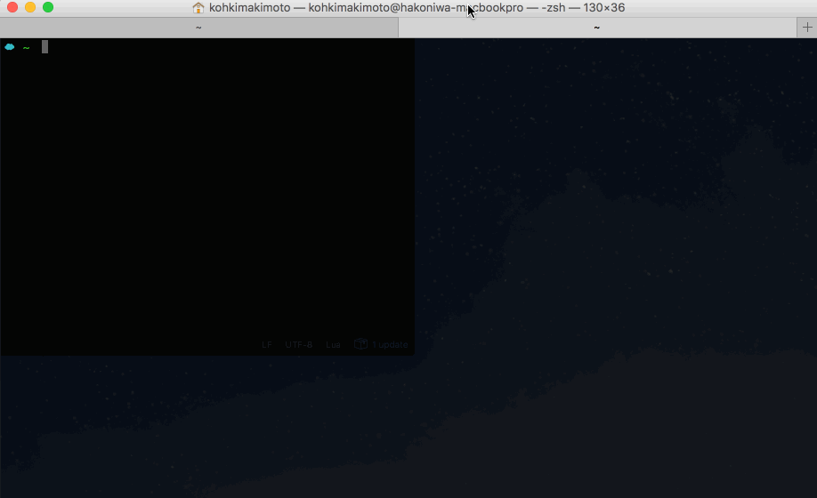

# ZSSH

Extended ssh command.

* This is a single binary CLI app.
* Simply wraps `ssh` command. You can use it in the same way as `ssh`.
* Supports to write SSH configuration in Lua programming language.
* Supports zsh completion.
* Provides some hook functions.

**There are many breaking changes from v0.3.0**



## Installation

ZSSH is provided as a single binary. You can download it and drop it in your $PATH.

[Download latest version](https://github.com/kohkimakimoto/zssh/releases/latest)

## Usage

Create and edit `~/.zssh/config.lua`. This is a main configuration file for ZSSH.
The configuration is written in Lua programming language.

```lua
Host "web01.localhost" {
    ForwardAgent = "yes",
    HostName = "192.168.0.11",
    Port = "22",
    User = "kohkimakimoto",
    description = "my web01 server",
}

Host "web02.localhost" {
    ForwardAgent = "yes",
    HostName = "192.168.0.12",
    Port = "22",
    User = "kohkimakimoto",
    description = "my web02 server",
}
```

This configuration generates the below ssh config to the temporary file like the `/tmp/zssh.ssh_config.260398422` when you run `zssh`.

```
Host web01.localhost
    ForwardAgent yes
    HostName 192.168.0.11
    Port 22
    User kohkimakimoto

Host web02.localhost
    ForwardAgent yes
    HostName 192.168.0.12
    Port 22
    User kohkimakimoto
```

ZSSH uses the generated config file by default.
It internally runs the command like the `ssh -F /tmp/zssh.ssh_config.260398422 <hostname>`.
And automatically removes the temporary file when `zssh` process finishes.
So you can connect a server using below simple command.

```
$ zssh web01.localhost
```

If you set a first character of keys as lower case like `description` in the config file, it is not SSH config.
It is used for specific functionality. Read the next section **Zsh Completion**.

### Zsh Completion

If you want to use zsh completion, add the following code in your `~/.zshrc`

```
eval "$(zssh --zsh-completion)"
```

You will get completion about hosts.

```
$ zssh [TAB]
web01.localhost          -- my web01 server
web02.localhost          -- my web02 server
```

You can hide a host using `hidden` property. If you set it true, zsh completion doesn't show the host.

```lua
Host "web01.localhost" {
    ForwardAgent = "yes",
    HostName = "192.168.0.11",
    Port = "22",
    User = "kohkimakimoto",
    description = "my web01 server",
    hidden = true,
}
```

### Hooks

You can add hook functions `before` and `after` in a host configuration.

```lua
Host "web01.localhost" {
    HostName = "192.168.0.11",
    Port = "22",
    User = "kohkimakimoto",
    ForwardAgent = "yes",
    description = "my web01 server",
    hooks = {
        before = function()
            -- This is an example to change screen color to red.
            os.execute("osascript -e 'tell application \"Terminal\" to set current settings of first window to settings set \"Red Sands\"'")
        end,
        after = function()
            -- This is an example to change screen color to black.
            os.execute("osascript -e 'tell application \"Terminal\" to set current settings of first window to settings set \"Pro\"'")
        end,
    }
}
```

`before` hook fires before you connect a server via SSH. `after` hook fires after you disconnect SSH connection.

### Variables

ZSSH provides `zssh` object to the Lua context. And you can set and get below variable.

`zssh.ssh_config`: Generated config file path. At default, a temporary file path when you run `zssh`. You can set static file path. For instance, If you set `zssh.ssh_config = os.getenv("HOME") .. "/.ssh/config"`, ZSSH overrides `~/.ssh/config` that is standard ssh config file per user.

## Useful functionality

### Running shell script

ZSSH supports easily running a bash script on the remote server.

```
$ zssh --shell web01.localhost /path/to/script.sh
```

Also you can get a script using http instead of local filesystem.

```
$ zssh --shell web01.localhost https://example/script.sh
```

### Running rsync

You can use zssh config for rsync using `--rsync` option.

```
$ zssh --rsync -avz /local/dir/ web01.localhost:/path/to/remote/dir
```

### Running scp

You can use zssh config for scp using `--scp` option.

```
$ zssh --scp web01.localhost:/path/to/file ./local/file
```

## Other options

Please check command line help that showed by running `zssh` command without any options.

```
Usage: zssh [<options>] [<ssh options and args...>]

ZSSH is an extended ssh command.
version 0.5.0 (075d81f9600e3f3bb73ccbbd1a3b3e7a41678b95)

Copyright (c) Kohki Makimoto <kohki.makimoto@gmail.com>
The MIT License (MIT)

Options:
  --version               Print version.
  --print                 Print generated ssh config.
  --config                Edit per-user config file.
  --system-config         Edit system wide config file.
  --config-file <file>    Load configuration from the specific file.
                          If you use this option, it does not use other default config files like a "/etc/zssh/config.lua".

  --hosts                 List hosts. This option can use with additional options.
  --filter <tag>          (Using with --hosts option) Show only the hosts configured with a tag.
  --verbose               (Using with --hosts option) List hosts with description.

  --tags                  List tags.

  --zsh-completion        Output zsh completion code.
  --debug                 Output debug log

  --shell     Change behavior to execute a shell script on the remote host.
              Take a look "Running shell script" section.
  --rsync     Change behavior to execute rsync.
              Take a look "Running rsync" section.
  --scp       Change behavior to execute scp.
              Take a look "Running scp" section.
...
```

## Author

Kohki Makimoto <kohki.makimoto@gmail.com>

## License

The MIT License (MIT)
