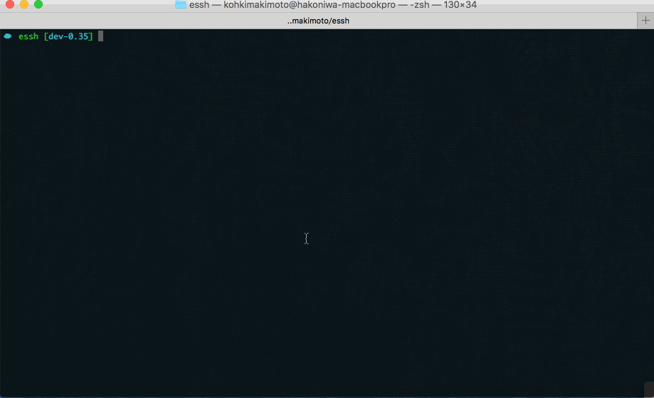

# Essh

Essh is an extended ssh client command. The features are the following:

* **Simple**: A single binary CLI tool. Essh simply wraps `ssh` command. You can use it in the same way as `ssh`.
* **Configuration As Code**: You can write SSH client configuration (aka:`~/.ssh/config`) in Lua code. So your ssh_config can become more dynamic.
* **Hooks**: Essh supports hooks that execute commands when it connects a remote server.
* **Servers List Management**: Essh provides utilities for managing hosts, that list and classify servers by using tags.
* **Zsh Completion**: Essh provides built-in zsh completion.
* **Per-Project Configuration**: Essh supports per-project configuration. This allows you to change SSH hosts config by changing current working directory.
* **Task Runner**: Task is code that runs on remote and local servers. You can use it to automate your system administration tasks.
* **Modules**: Essh provides modular system that allows you to use, create and share reusable Lua code easily.

> **Now Essh is on unstable stage. API and code may be broken in future. And document lacks. sorry!**


**Demo1: Completing a hostname and changing terminal color by using hook.**


**Demo2: Listing and filtering hosts. Running a command on the selected hosts.**



**Simple Configuration Example: `host` and `task`**

```lua
host "web01.localhost" {
    HostName = "192.168.0.11",
    Port = "22",
    User = "kohkimakimoto",
    tags = {
        "web",
    },
}

task "deploy" {
    description = "deploy new application.",
    prefix = true,
    parallel= true,
    on = "web",
    script = [=[
        cd /path/to/dir
        git clone git@github.com:path/to/app.git
        cd repo
        make
        echo "Done!"
    ]=],
}
```

Are you interesting in Essh? There are documents below. Please start to read **[Getting Started](#getting-started)**.

Table of contents

* [Getting Started](#getting-started)
  * [Installation](#installation)
  * [Using As SSH](#using-as-ssh)
  * [Zsh Completion](#zsh-completion)
  * [Using Hooks](#using-hooks)
  * [Managing Hosts](#managing-hosts)
  * [Running Commands](#running-commands)
  * [Running Tasks](#running-tasks)
  * [Using Lua Libraries](#using-lua-libraries)
  * [Using Modules](#using-modules)
  * [Using Drivers](#using-drivers)
  * [Next Steps](#next-steps)
* [Configuration Files](#configuration-files)  
* [Hosts](#hosts)
* [Tasks](#tasks)
* [Lua Libraries](#lua-libraries)
* [Modules](#modules)
* [Drivers](#drivers)
* [Command Line Options](#command-line-options)
* [Integrating Other SSH Related Commands](#integrating-other-ssh-related-commands)
* [Author](#author)
* [License](#license)

## Getting Started

This section covers the basic features of Essh. If you are begginer of Essh, I recommend you to read it at first.

### Installation

Essh is provided as a single binary. You can download it and drop it in your $PATH.

[Download latest version](https://github.com/kohkimakimoto/essh/releases/latest)

After installing Essh, run the `essh` without any options in your terminal to check working.

```
$ essh
Usage: essh [<options>] [<ssh options and args...>]

  essh is an extended ssh command.
  version 0.29.0 (01b0ee302d8ac207c05b03affbc118e415ac4b81)

  Copyright (c) Kohki Makimoto <kohki.makimoto@gmail.com>
  The MIT License (MIT)

See also:
  essh --help

```

### Using As SSH

Essh is implemented as a wrapper of `ssh` command. That means you can completely use Essh in the same way as `ssh`. Try to connect a remote server by using Essh like `ssh` command.

Create `essh.lua` in your current directory. This is a configuration file for Essh. The configuration is written in [Lua](https://www.lua.org/) programming language. Now edit this file as the following.

> Replace the `HostName` and some parameters for your environment.

```lua
host "web01.localhost" {
    ForwardAgent = "yes",
    HostName = "192.168.0.11",
    Port = "22",
    User = "kohkimakimoto",
}

host "web02.localhost" {
    ForwardAgent = "yes",
    HostName = "192.168.0.12",
    Port = "22",
    User = "kohkimakimoto",
}
```

This configuration automatically generates the below ssh config to the temporary file like the `/tmp/essh.ssh_config.260398422` whenever you run `essh`.

```
Host web01.localhost
    ForwardAgent yes
    HostName 192.168.0.11
    Port 22
    User kohkimakimoto

Host web02.localhost
    ForwardAgent yes
    HostName 192.168.0.12
    Port 22
    User kohkimakimoto
```

Essh uses this generated config file by default. If you run the below command

```
$ essh web01.localhost
```

Essh internally runs the `ssh` command like the following.

```
ssh -F /tmp/essh.ssh_config.260398422 web01.localhost
```

Therefore you can connect with a ssh server using Lua config.

Essh also automatically removes the temporary file when the process finishes. So you don't have to be conscious of the real ssh configuration in the normal operations.

### Zsh Completion

Essh supports zsh completion that lists SSH hosts. If you want to use it, add the following code in your `~/.zshrc`

```
eval "$(essh --zsh-completion)"
```

And then, edit your `essh.lua`. Try to add the `description` property as the following.

```lua
host "web01.localhost" {
    ForwardAgent = "yes",
    HostName = "192.168.0.11",
    Port = "22",
    User = "kohkimakimoto",
    -- add description
    description = "web01 development server",
}

host "web02.localhost" {
    ForwardAgent = "yes",
    HostName = "192.168.0.12",
    Port = "22",
    User = "kohkimakimoto",
    -- add description
    description = "web02 development server",
}
```

You will get completion about hosts.

```
$ essh [TAB]
web01.localhost  -- web01 development server
web02.localhost  -- web02 development server
```

You can hide a host using `hidden` property. If you set it true, zsh completion doesn't show the host.

```lua
host "web01.localhost" {
    ForwardAgent = "yes",
    HostName = "192.168.0.11",
    Port = "22",
    User = "kohkimakimoto",
    description = "web01 development server",
    hidden = true,
}
```

You notice that the first characters of the `description` and `hidden` are lower case. Others are upper case. It is important point. Essh uses properties whose first character is upper case, as **ssh_config** generated to the temporary file. And the properties whose first character is lower case are used for special purpose of Essh functions, not ssh config.

For more information on hosts, see the [Hosts](#hosts) section.

### Using Hooks

Hooks in Essh are scripts executed before and after connecting remote servers.

```lua
host "web01.localhost" {
    HostName = "192.168.0.11",
    Port = "22",
    User = "kohkimakimoto",

    hooks = {
        before_connect = "echo before_connect",
        after_connect = "echo after_connect",
        after_disconnect = "echo after_disconnect",
    },
}
```

`before_connect` fires on the localhost before you connect a server via SSH.
`after_connect` fires on the remote host after you connect a server via SSH.
`after_disconnect` fires on the local host after you disconnect from a SSH server.

> Note: I am using this functionality to change OSX terminal profile(color). See the below example.

```lua
host "web01.localhost" {
    -- ...
    hooks = {
        before_connect = "osascript -e 'tell application \"Terminal\" to set current settings of first window to settings set \"Blue Profile\"'",
        after_disconnect = "osascript -e 'tell application \"Terminal\" to set current settings of first window to settings set \"Normal Profile\"'",
    },
}
```

### Managing Hosts

Tags allow you to classify hosts. For instance, edit `essh.lua` to add some hosts and set tags.

```lua
host "web01.localhost" {
    -- ... your config
    description = "web01 development server",
    tags = {
        "web",
    }
}

host "web02.localhost" {
    -- ... your config
    description = "web02 development server",
    tags = {
        "web",
    }
}

host "db01.localhost" {
    -- ... your config
    description = "db01 server",
    tags = {
        "db",
        "backend",
    }
}

host "cache01.localhost" {
    -- ... your config
    description = "cache01 server",
    tags = {
        "cache",
        "backend",
    }
}
```

Run `essh` with `--hosts` option.

```
$ essh --hosts
NAME                 DESCRIPTION                 TAGS         
web01.localhost      web01 development server    web          
web02.localhost      web02 development server    web          
db01.localhost       db01 server                 db,backend   
cache01.localhost    cache01 server              cache,backend
```

You can see the all hosts. Next, try to run it with `--filter` option.

```
$ essh --hosts --filter=web
NAME               DESCRIPTION                 TAGS
web01.localhost    web01 development server    web
web02.localhost    web02 development server    web
```

You will get filtered hosts by `web` tag. `--filter` can be specified multiple times. Each filters are used in OR condition.

```
$ essh --hosts --filter=web --filter=db
NAME               DESCRIPTION                 TAGS      
web01.localhost    web01 development server    web       
web02.localhost    web02 development server    web       
db01.localhost     db01 server                 db,backend
```

For more information on hosts, see the [Hosts](#hosts) section.

### Running Commands

Essh allow you to run commands on the selected remote hosts by using `--exec` and `--on` options.

```
$ essh --exec --on=web uptime
 22:48:31 up  7:58,  0 users,  load average: 0.00, 0.01, 0.03
 22:48:31 up  7:58,  0 users,  load average: 0.00, 0.02, 0.04
```

Use `--prefix` option, Essh outputs result of command with hostname prefix.

```
$ essh --exec --on=web --prefix uptime
[web01.localhost]  22:48:31 up  7:58,  0 users,  load average: 0.00, 0.01, 0.03
[web02.localhost]  22:48:31 up  7:58,  0 users,  load average: 0.00, 0.02, 0.04
```

For more information, see the [Command Line Options](#command-line-options) section.

### Running Tasks

You can define tasks that are executed on remote and local servers.
For example, edit your `essh.lua`.

```lua
task "hello" {
    description = "say hello",
    prefix = true,
    on = "web",
    script = [=[
        echo "hello on $(hostname)"
    ]=],
}
```

Run the task.

```
$ essh hello
[web01.localhost] hello on web01.localhost
[web02.localhost] hello on web02.localhost
```

If you don't specify `on` property, Essh runs a task locally.

```lua
task "hello" {
    description = "say hello",
    prefix = true,
    script = [=[
        echo "hello on $(hostname)"
    ]=],
}
```

```
$ essh hello
[Local] hello on your-hostname
```

For more information on tasks, see the [Tasks](#tasks) section.

### Using Lua Libraries

Essh uses [GopherLua](https://github.com/yuin/gopher-lua) as a Lua VM to load configuration files written in Lua.
Essh also has several built-in Lua libraries. You can use `require` function to load the libraries.

Example:

```lua
local question = require "essh.question"

task "example" {
    prepare = function ()
        local r = question.ask("Are you OK? [y/N]: ")
        if r ~= "y" then
            -- return false, the task does not run.
            return false
        end
    end,
    script = [=[
        echo "foo"
    ]=],
}
```

`essh.question` is a built-in library of Essh, that is implemented by [gluaquestion](https://github.com/kohkimakimoto/gluaquestion). It provides functions to get user input from a terminal.
And task's property `prepare` is a configuration that defines a function executed when the task starts.

So, You run the task. Essh displays a message and waits your input.

```
$ essh example
Are you OK? [y/N]: y
foo
```

For more information on Lua libraries, see the [Lua Libraries](#lua-libraries) section.

### Using Modules

Essh has a modular system that allows you to use reusable code easily for Essh configuration.
For instance, I provide [bash module](https://github.com/kohkimakimoto/essh/tree/master/modules/bash) that is a collection of bash scripts for using in your Essh tasks.
You can use `essh.require` function to load a module.

Example:

```lua
local bash = essh.require "github.com/kohkimakimoto/essh/modules/bash"

task "example" {
    script = {
        bash.version,
        "echo foo",
    },
}
```

`bash.version` is a variable that actually is a simple string `bash --version`. So this task prints bash version and then runs `echo foo`.

The modules are installed automatically, when you run Essh.
You run the task, you will get as below.

```
$ essh example
Installing module: 'github.com/kohkimakimoto/essh/modules/bash' (into /path/to/directory/.essh)
GNU bash, version 4.1.2(1)-release (x86_64-redhat-linux-gnu)
Copyright (C) 2009 Free Software Foundation, Inc.
License GPLv3+: GNU GPL version 3 or later <http://gnu.org/licenses/gpl.html>

This is free software; you are free to change and redistribute it.
There is NO WARRANTY, to the extent permitted by law.
foo
```

For more information on Modules, see the [Modules](#modules) section.

### Using Drivers

Drivers in Essh are templates to construct script in tasks execution.
Essh usually executes tasks by using built-in default driver. But you can also use your custome drivers.

This is an advanced topic. For more information on Drivers, see the [Drivers](#drivers) section.

### Next Steps

In the [Getting Started](#getting-started) guide. I have explained the basic features of Essh. If you want to get in-depth information about Essh, proceed to the next section.

## Configuration Files

Essh configuration is written in [Lua](https://www.lua.org/). In the configuration files, you can also use DSL syntax that is more human-readable. Here is an example:

```lua
host "web01.localhost" {
    HostName = "192.168.0.11",
    Port = "22",
    User = "kohkimakimoto",
    description = "web01 development server",
    tags = {
        "web",
    },
}

host "web02.localhost" {
    HostName = "192.168.0.12",
    Port = "22",
    User = "kohkimakimoto",
    description = "web02 development server",
    tags = {
        "web",
    },
}

task "uptime" {
    on = "web",
    script = "uptime",
}
```

Essh loads configuration files from three different places.

* At first, loads `/etc/essh/config.lua` that is the system-wide configuration.
* At second, loads `~/.essh/config.lua` that is the per-user configuration.
* At last, loads `essh.lua` in the current directory for the per-project configuration.

## Hosts

Hosts in Essh are managed SSH servers. Using hosts configuration, Essh dynamically generates SSH config, provides hook functions, classify the hosts by tags.

### Example

```lua
host "web01.localhost" {
    -- SSH config properties.
    HostName = "192.168.0.11",
    Port = "22",
    User = "kohkimakimoto",

    -- Special purpose properties.
    description = "web01 development server",
    hidden = false,
    props = {},
    tags = {},
    hooks = {
        before_connect = "",
        after_connect = "",
        after_disconnect = "",
    },
}
```

Host is composed of two different kinds of properties. **SSH config properties** and **Special purpose properties**.

### SSH config properties

SSH config properties require that the first character is upper case.
For instance `HostName` and `Port`. They are used to generate **ssh_config**. You can use all ssh options to these properties. see ssh_config(5).

### Special purpose properties

Special purpose properties require first character is lower case.
They are used for special purpose of Essh functions, not ssh_config.

All the properties of this type are listed below.

* `description` (string): Description is a description of the host.
* `hidden` (bool): If you set it true, zsh completion doesn't show the host.
* `hooks` (table): Hooks is a table that defines `before_connect`(string or function), `after_connect`(string or function) and `after_disconnect`(string or function).

    ```lua
    hooks = {
        -- WIP...
    }
    ```

* `tags` (array table): Tags classify hosts.

    ```lua
    tags = {
        "web",
        "production",
    }
    ```
* `props` (table): Props set environment variables when the host is used in tasks.

    ```lua
    props = {
        foo = "bar",
    }

    -- you get the environment variables in tasks.
    -- ESSH_PROPS_FOO=bar
    ```

## Tasks

WIP...

## Lua Libraries

Essh provides built-in Lua libraries that you can use in your configuration files.
For instance, if you want to use `essh.json` library, you should use Lua's `require` function like below.

```lua
local json = require("essh.json")

local jsontext = json.encode({aaa = "bbb", ccc = "ddd"})
print(jsontext)
```

The following are the built-in libraries that are included in Essh.

* `essh.json`: Json encoder/decoder. It is implemented by [gluajson](https://github.com/kohkimakimoto/gluajson).
* `essh.fs`: Filesystem utility. It is implemented by [gluafs](https://github.com/kohkimakimoto/gluafs).
* `essh.yaml`: Yaml parser. It is implemented by [gluayaml](https://github.com/kohkimakimoto/gluayaml).
* `essh.template`: Text template. It is implemented by [gluatemplate](https://github.com/kohkimakimoto/gluatemplate).
* `essh.question`: A library to prompt the user for input. It is implemented by [gluaquestion](https://github.com/kohkimakimoto/gluaquestion).
* `essh.http`: Http module. It is implemented by [gluahttp](https://github.com/cjoudrey/gluahttp).

Of course, You can also use another Lua libraries by using `require`. See the Lua's [manual](http://www.lua.org/manual/5.1/manual.html#pdf-require).

## Modules

WIP...

## Drivers

WIP...

## Command Line Options

* `--version`: Print version.
* `--help`: Print help.
* `--print`: Print generated ssh config.

WIP...

## Integrating Other SSH Related Commands

Essh can be used with `scp`, `rsync` and `git`.

* `git`: To use Essh inside of the git command. Write the following line in your `~/.zshrc`.

    ```
    export GIT_SSH=essh
    ```

* `scp`: Essh support to use with scp.

  ```
  $ essh --scp <scp command args...>
  ```

  For more easy to use, you can run `eval "$(essh --aliases)"` in your `~/.zshrc`, the above code can be written as the following.

  ```
  $ escp <scp command args...>
  ```

* `rsync`: Essh support to use with rsync.

  ```
  $ essh --rsync <rsync command args...>
  ```

  For more easy to use, you can run `eval "$(essh --aliases)"` in your `~/.zshrc`, the above code can be written as the following.

  ```
  $ ersync <rsync command args...>
  ```

## Author

Kohki Makimoto <kohki.makimoto@gmail.com>

## License

The MIT License (MIT)
